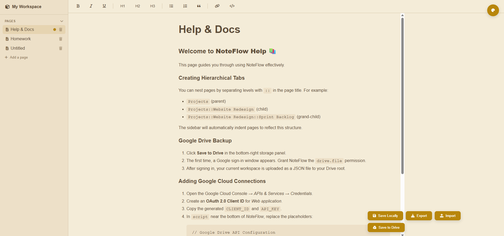

# NoteFlow - A Local-First, Private Alternative to Notion

**Your notes, your data, your machine. All in a single HTML file.**



NoteFlow is a powerful, self-contained note-taking application that runs entirely in your browser. It's designed for users who value privacy, data ownership, and simplicity. Unlike cloud-based services like Notion, NoteFlow is **local-first**, meaning your entire workspace lives on your device. No accounts, no servers, no subscriptions.

## Why NoteFlow? The Local-First Advantage

In an era of cloud lock-in and privacy concerns, NoteFlow puts you back in control.

* ✅ **Truly Private**: Cloud services can access your notes. NoteFlow stores everything in your browser's local storage. Your data never leaves your machine unless you explicitly export or back it up.
* ✅ **No Lock-In**: Your entire workspace can be exported as a single, human-readable `.json` file. This makes backups, migration, and sharing effortless.
* ✅ **Offline & Always Available**: Since it's a local file, your workspace is always accessible, even without an internet connection. No more downtime or server dependence.
* ✅ **Full Ownership**: Your pages, themes, and data are yours. Period.

## ✨ Features

* **📝 Rich Text Editor**: Format your notes with headers, bold, italics, lists, blockquotes, code blocks, and more.
* **🗂️ Hierarchical Pages**: Organize your notes with infinite nesting. Simply use `::` in your page titles (e.g., `Projects::Website Redesign::Tasks`) to create a beautifully structured and indented sidebar.
* **🎨 Advanced Theming Engine**:
    * Apply themes to a single page, all pages, or a custom selection of pages.
    * Choose from 6 beautiful preset themes (including Dark, Sepia, and Forest).
    * Create your own themes with a custom color picker for backgrounds, text, and accents.
* **💾 Robust Data Management**:
    * **Auto-Save**: Changes are saved automatically to your browser's local storage.
    * **Export/Import**: Download your entire workspace to a single `.json` file for easy backups or sharing.
    * **Optional Google Drive Backup**: Securely back up your workspace to your own Google Drive account.
* **⌨️ Keyboard Shortcuts**: Boost your productivity with shortcuts for saving, creating new pages, and toggling the theme panel.
* **🚀 Zero Installation**: It's just one HTML file. No dependencies, no build steps, no servers to manage.
* **📚 Built-in Help**: A "Help & Docs" page is automatically created to get you started with all the key features.

## 🚀 Getting Started

1.  **Download**: Get the `GPT o3 improving on Grok 4.html` file.
2.  **Rename (Optional)**: Rename it to `noteflow.html` or `index.html` for convenience.
3.  **Open**: Open the file in a modern web browser like Chrome, Firefox, or Edge.

That's it! You can start creating notes immediately. Your work will be saved automatically in the browser you are using.

## 💾 Saving & Data Portability

* **Local Storage**: Your primary workspace is saved in your browser's `localStorage`. This is fast and works offline but is tied to that specific browser and device.
* **Export (Recommended for Backups)**: Use the **Export** button to save a complete `noteflow_export.json` file. This is the best way to create backups, move your workspace between devices, or share it with others.
* **Import**: Use the **Import** button to load a `.json` file and instantly restore a workspace.

## ☁️ Setting up Google Drive Backup (Optional)

For added peace of mind, you can enable backups to your own Google Drive. This requires setting up free Google Cloud credentials.

1.  **Open the HTML file** in a text editor.
2.  Go to the [Google Cloud Console](https://console.cloud.google.com/) → *APIs & Services* → *Credentials*.
3.  Create an **OAuth 2.0 Client ID** for a *Web application*. You will need to configure the authorized origins to include the URL where you are hosting the file (or `null` for local files).
4.  Create an **API Key**.
5.  Find the following lines in the `<script>` section of the HTML file:
    ```javascript
    // Google Drive API Configuration
    const CLIENT_ID = 'YOUR_CLIENT_ID'; // Replace with your Google Client ID
    const API_KEY = 'YOUR_API_KEY'; // Replace with your Google API Key
    ```
6.  Replace the placeholder values with your actual Client ID and API Key.
7.  Uncomment the line `// initGoogleDrive();` at the bottom of the script to enable the feature:
    ```javascript
    document.addEventListener('DOMContentLoaded', () => {
        initApp();
        // Uncomment the next line when you have Google API credentials
        initGoogleDrive(); // <-- Like this
    });
    ```
8.  Save the file. The "Save to Drive" button will now be fully functional.

## 🔐 Privacy by Design

* No trackers.
* No background syncing (unless you enable and use the Google Drive feature).
* No corporate lock-in.
* Your notes = your ownership.
